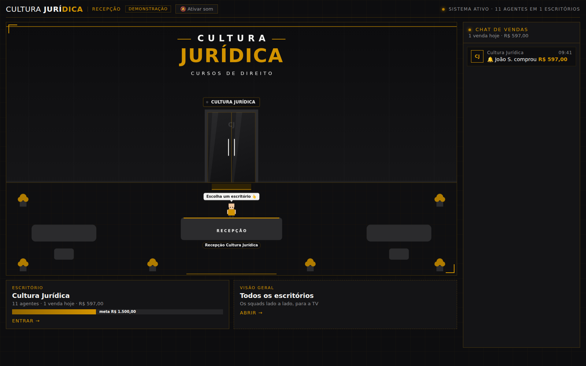
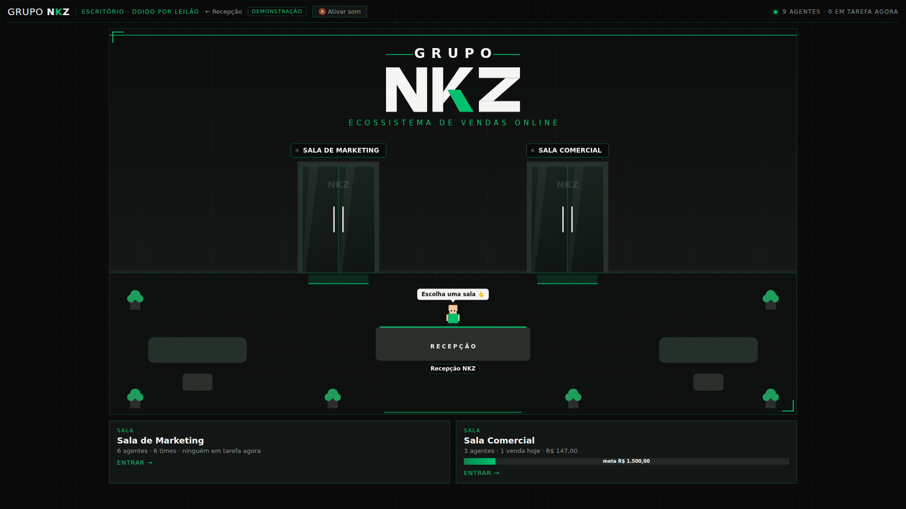
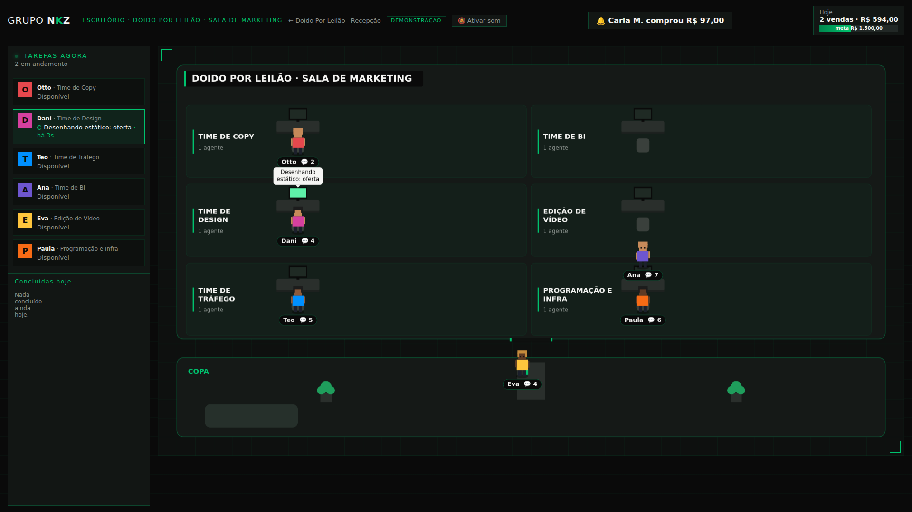
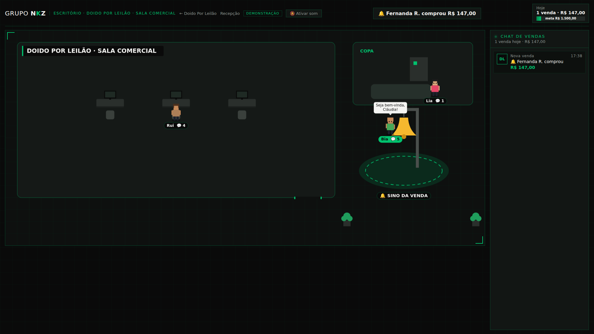

# Cultura Jurídica: operação de marketing com squads de IA

Cada projeto (infoproduto) tem um **squad** de 9 agentes de IA que cria ofertas,
copys, páginas, anúncios e campanhas, analisa os resultados e atende os leads.

O site é um prédio virtual na identidade da Cultura Jurídica (preto, branco e dourado):

- **`/` (recepção):** o saguão com o logotipo e uma porta para cada escritório.
  Cada venda traz um cliente que entra pela porta do projeto; quando um projeto
  bate a meta, a recepção comemora. Os cartões embaixo mostram vendas e meta do dia.
- **`/escritorio/<projeto>`:** o hall do projeto, com o nome dele na parede e duas portas:
  - **`/escritorio/<projeto>/marketing`:** a Sala de Marketing, com uma fila por time
    (Copy, Design, Tráfego, BI, Edição de Vídeo e Programação e Infra) e a coluna
    "Tarefas agora" à esquerda.
  - **`/escritorio/<projeto>/comercial`:** a Sala Comercial, com os agentes de
    atendimento, o sino da venda e o chat de vendas do projeto à direita.

  O time de cada função vem de `funcoes.time`. Funções com o agente desativado
  (copy de página, copy de estáticos, roteirista de vídeo e otimizador) mandam suas
  tarefas para o agente ativo do mesmo time.
- **`/escritorio`:** todos os squads lado a lado, para deixar numa TV.
- **Tarefas agora:** na lateral esquerda da Sala de Marketing, o que cada
  agente do marketing está fazendo (e há quanto tempo) e o que já concluiu hoje.
  Vem da tabela `tarefas`: todo trabalho de agente abre uma tarefa ao começar e
  fecha ao terminar (`comTarefa` em `src/lib/tarefas.ts`); enquanto ela está aberta,
  o agente fica na mesa com o monitor piscando.
- **Chat de vendas:** na lateral direita de todas as telas, as vendas (e as metas
  batidas) do dia vão aparecendo ao vivo. Na recepção e na visão geral, de todos
  os projetos; na Sala Comercial, só as daquele projeto.









Projeto inicial: **Cultura Jurídica** (`cultura-juridica`, sigla CJ), já com atendimento no WhatsApp.

## O squad de cada projeto

| # | Função | O que faz |
|---|---|---|
| 01 | Estrategista de ofertas | Cria novas ofertas para o infoproduto |
| 02 | Copywriter de página | Escreve a copy da página de vendas |
| 03 | Copywriter de estáticos | Escreve a copy dos anúncios estáticos |
| 04 | Roteirista de vídeo | Escreve os roteiros dos anúncios em vídeo |
| 05 | Construtor de páginas | Monta e publica a página de vendas |
| 06 | Designer | Cria os anúncios estáticos |
| 07 | Editor de vídeo | Cria os anúncios em vídeo |
| 08 | Gestor de tráfego | Cria as campanhas no Meta Ads |
| 09 | Otimizador | Otimiza as campanhas no Meta Ads |
| 10 | Analista | Analisa os resultados e envia o relatório ao time de copy |
| 11 | (ciclo) | O time de copy usa o relatório para criar a próxima rodada |
| 12 | Comercial (3 agentes) | Pop-up, abandono de carrinho e pós-venda no WhatsApp |
| 13 | Escritório virtual | Mostra tudo isso acontecendo |

Para adicionar um projeto novo: crie a linha em `projetos` e rode o bloco de
agentes do `supabase/seed.sql` com os nomes do novo squad.

## Fases

- [x] **Fase 1: base e escritório (pontos 10 e 13).** Banco de dados, escritório
  virtual, vendas e carrinhos da Kiwify, mensagens da Z-API, métricas diárias do Meta
  Ads e relatório diário do analista (Claude) enviado por WhatsApp.
- [x] **Fase 2: fábrica de criativos (01 a 07).** No painel de cada projeto
  (`/escritorio/<projeto>/painel`, botão "📋 Painel do projeto" no escritório; login por e-mail),
  você faz **pedidos ao time**: texto livre (com sugestões), o que entregar e quanto
  (nova oferta, página, N estáticos no formato escolhido, N vídeos na duração escolhida)
  e referências em anexo (imagens, PDF, links), que os agentes seguem. Tudo aparece num
  **quadro Kanban** (Na fila → Em produção → Para aprovar → Reprovado/Aprovado); ao clicar
  num cartão abre a peça com tudo para analisar e os botões Aprovar, **Refazer** (o time
  faz uma nova versão com base no motivo) e Reprovar, sempre com motivo. Os campos de
  texto têm ditado por voz (🎙️, reconhecimento de fala do navegador). Além disso:
  o agente lê a página de vendas e monta o briefing; cada rodada traz 1 oferta, a
  página de vendas, 3 estáticos e 2 vídeos, todos aguardando aprovação. Os
  estáticos e vídeos são desenhados pelo Claude em HTML/CSS (vídeo em motion
  graphics). Página aprovada fica pública em `/p/<id>`. Reprovações com motivo
  voltam como aprendizado para a próxima rodada. Uma rodada nova por projeto sai
  todo dia às 9h30 (Brasília), depois do relatório.

  **Economia de tokens.** A rodada diária vai em lote (Batch API, metade do preço): o cron
  envia, e o resultado é coletado quando alguém abre o painel ou no próximo cron (tabela
  `lotes_ia`; peças no lote aparecem como "🌙 No lote do dia" e "Produzir agora" faz na hora,
  pelo preço cheio). Pedidos feitos pelo painel continuam na hora. Todas as chamadas guardam
  em cache a persona do agente e o contexto que se repete (briefing, oferta, referências),
  que nas chamadas seguintes custa cerca de 5% do preço. O esforço de raciocínio é "médio" por
  padrão; só a criação de oferta e copy usa "alto".
- [x] **CRM da Sala Comercial.** Embaixo da sala, os leads do projeto em kanban (só para a
  equipe logada): 01 Para atender, 02 Em atendimento, 03 Follow-ups, 04 Aguardando pagamento,
  05 Compra feita e 06 Perdido. Formulário, WhatsApp e Kiwify se juntam no mesmo card pelo
  telefone (ou e-mail). Pix/boleto gerado leva para Aguardando pagamento e compra paga para
  Compra feita. Follow-up: sem resposta há 2 h vai para Follow-ups; depois de 4 tentativas
  (a cada 2 h) ou 3 dias, vai para Perdido. Respondeu, volta para o atendimento. Dá para
  arrastar os cards e abrir a conversa. Os formulários das páginas enviam para
  `POST /api/leads` com `{ projeto, nome, telefone, email, funil, utm }` (o campo `site` é
  armadilha para robôs e deve ficar vazio).
- [x] **Atendimento no WhatsApp (Evolution API).** Uma instância por projeto
  (`projetos.whatsapp_instancia`, e o projeto só é atendido com `atendimento_ia = true`).
  Webhook `POST /api/webhooks/evolution?secret=<EVOLUTION_WEBHOOK_SECRET>` com o evento
  `MESSAGES_UPSERT`. Os agentes comerciais (Sonnet 5.5) respondem com o briefing do funil:
  Lia (quem chamou ou se cadastrou), Rui (carrinho e pagamento pendente) e Bia (pós-venda).
  Mandou o link → Aguardando pagamento; pedido de humano, reclamação ou dúvida fora do
  briefing → etiqueta "🙋 humano" e a IA para. Quem responde pelo celular do projeto também
  pausa a IA no lead. O agendador do Supabase (pg_cron, a cada 15 min) chama
  `/api/cron/comercial`: primeiro contato com quem se cadastrou ou abandonou o carrinho e
  follow-ups (2 h, até 4), só das 8h às 21h. "Parar"/"sair" vira opt-out.
- [ ] **Fase 3: comercial (12).** Respostas automáticas no WhatsApp para pop-up,
  abandono de carrinho e compradores.
- [ ] **Fase 4: tráfego (08 e 09).** Criação e otimização de campanhas pela API do
  Meta, sempre abaixo do `limite_gasto_diario` de cada projeto.
- [ ] **Fase 5: ciclo fechado (11).** O relatório dispara a próxima rodada de
  criativos sem intervenção humana. As aprovações manuais saem uma a uma, conforme
  os números mostrarem que a IA acerta.

## Como funciona

```
Kiwify ──webhook──▶ /api/webhooks/kiwify ─┐
Z-API  ──webhook──▶ /api/webhooks/zapi  ──┤
Meta   ◀──cron 1d── /api/cron/meta-sync ──┼──▶ Supabase ──Realtime──▶ Escritório (/)
Claude ◀──cron 1d── /api/cron/relatorio ──┘        │
                         └──▶ WhatsApp (relatório)  └─ agente_eventos
```

Tudo o que um agente faz vira uma linha em `agente_eventos`. O escritório escuta
essa tabela: numa venda, o agente vai até o sino e o squad comemora; num
relatório, o analista leva o time de copy para a sala de resultados.

**Meta do dia:** cada projeto tem uma `meta_diaria` (em reais). Quando as vendas
do dia (horário de Brasília) passam da meta, o banco gera o evento `meta_batida`
e o escritório do projeto e a recepção comemoram: todos pulam e gritam, chove
confete, aparece a faixa com o nome do projeto e toca uma fanfarra com aplausos.
O placar mostra o progresso de cada projeto até a meta.

O sino tem som (três badaladas a cada venda). Os navegadores só tocam áudio
depois de um clique, então use o botão **🔕 Ativar som** no topo ao abrir a tela.
Ativado na recepção, ele continua ligado ao entrar nos escritórios.
Numa TV que fica ligada direto, abra o Chrome com
`--autoplay-policy=no-user-gesture-required` ou clique no botão uma vez.

O escritório mostra só o primeiro nome e a inicial do sobrenome dos clientes,
porque vai para uma TV. O navegador só consegue ler `agentes`, `agente_eventos`,
`funcoes` e o nome dos projetos; vendas, leads e contas de anúncio ficam
fechados para o público.

## Configuração

1. **Supabase.** Crie um projeto (região São Paulo) e rode as migrações de
   `supabase/migrations/` na ordem do nome e depois o `supabase/seed.sql`
   (SQL Editor ou `supabase db push`).
2. **Projetos.** Em `projetos`, preencha para cada um:
   - `kiwify_produto_ids`: os IDs dos produtos na Kiwify;
   - `meta_ad_account_id`: a conta de anúncios, sem o `act_`;
   - `limite_gasto_diario`: o teto em reais que a IA nunca pode passar;
   - `meta_diaria`: a meta de vendas do dia, em reais, que dispara a comemoração.
3. **Variáveis de ambiente.** Copie `.env.example` para `.env.local` e preencha.
   Na Vercel, cadastre as mesmas variáveis no projeto.
4. **Kiwify.** Em Apps → Webhooks, crie um webhook para
   `https://<seu-domínio>/api/webhooks/kiwify` com os eventos de compra aprovada,
   reembolso, chargeback e carrinho abandonado. Use o token dele em `KIWIFY_WEBHOOK_TOKEN`.
5. **Z-API.** No webhook "Ao receber", use
   `https://<seu-domínio>/api/webhooks/zapi?secret=<ZAPI_WEBHOOK_SECRET>`.
6. **Meta.** Gere um token de usuário do sistema no Business Manager com
   `ads_read` (a Fase 4 vai precisar de `ads_management`).
7. **Deploy na Vercel.** Os crons estão em `vercel.json`: métricas às 10h UTC
   (7h em Brasília) e relatório às 11h30 UTC (8h30 em Brasília). No plano Hobby
   cada cron roda no máximo uma vez por dia e o horário pode variar dentro da
   hora. Quando o otimizador (Fase 4) precisar de métricas de hora em hora, será
   preciso o plano Pro.

8. **Painel de aprovação.** No Supabase, em Authentication → URL Configuration,
   coloque `https://escritorio-virtual-murex.vercel.app` em *Site URL* e
   `https://escritorio-virtual-murex.vercel.app/painel` em *Redirect URLs* (o `/painel` só recebe o link
   do e-mail e devolve a pessoa ao painel do projeto de onde ela veio). Depois cadastre quem
   pode aprovar: `insert into equipe (email, nome) values ('voce@exemplo.com', 'Seu nome');`

Sem as variáveis do Supabase, o escritório abre em **modo demonstração**, com
eventos simulados.

```bash
npm install
npm run dev        # http://localhost:3000
npm run typecheck
```

### O que conferir com os primeiros dados reais

- **Valores da Kiwify:** o código trata `Commissions.charge_amount` como centavos.
  O payload bruto fica salvo em `vendas.payload`; confira na primeira venda.
- **Carrinho abandonado:** a Kiwify manda um formato diferente do de pedido. O
  código trata os dois, mas vale conferir o primeiro que chegar.
- **Origem dos leads do WhatsApp:** por enquanto o lead entra sem projeto. A
  Fase 3 liga o lead ao projeto pelo pop-up e pelo carrinho.
